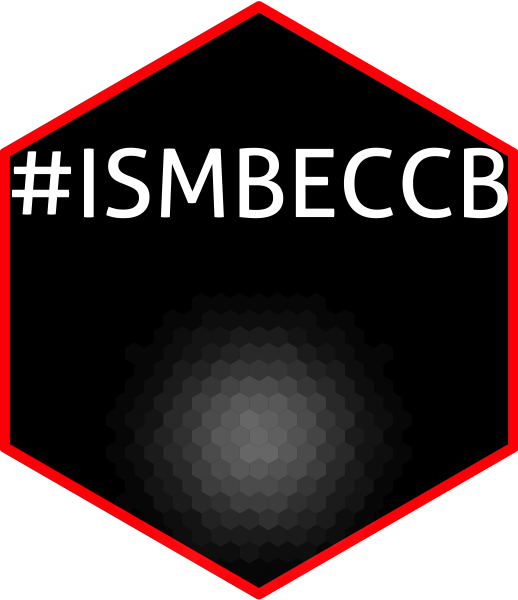

# ISMB2019 

<!-- badges: start -->
<!-- badges: end -->

[](https://twitter.com/nerd_yie)  


The goal of ISMB2019 is to provide quick access to tweets that were tweeted during the ISMB/ECCB 2019, Basel. This will help researchers to get summary of different talks from kind tweeters.

## Installation

``` r
devtools::install_github("itsvenu/ISMB2019")
```

## Example

``` r
library(ISMB2019)
library(magrittr)

data(ismb_dat2019)

## date
my_day <- "2019-07-24"

## start time of talk HH:MM
start_time <- "16:00"

## end time of talk HH:MM
end_time <- "17:00"

ISMB2019::get_tweets(my_day = my_day, start_time = start_time, end_time = end_time)
```


